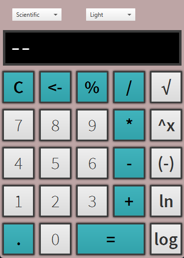

<h1>CalculatorV2</h1>

 </img>
 </img>
 </img>

<h2>Overview</h2>

CalculatorV2 is a JavaFX-based calculator application that supports basic and scientific calculations. The project is structured to offer a clean, responsive user interface with themes and two seperate layouts.

<h3>Features</h3>

<b>Basic Layout:</b> Perform standard arithmetic operations.

<b>Scientific Layout:</b> Includes advanced functions such as logarithmic, and exponential calculations. (Plan to add trigonometric functions)

<b>Themes:</b> Choose between different themes to customize the appearance.

<b>Keyboard Input Support:</b>  
shift + 5 -> %  
shift + - -> Negative  
N -> Natural Logarithm  
L -> Logarithm  
X -> Exponent  
Esc -> Clear  
Enter -> Equals

Uses Maven for building the project.

<h2>Steps:</h2>

<h3>Clone the repository:</h3>

<code>git clone https://github.com/jcjr30/Calculator.git</code>

<h3>Navigate to the project directory:</h3> 

<code>cd Calculator</code>

<h3>Build the project using Maven:</h3> 

<code>mvn clean package</code>

<h3>To run the application, use the following Maven command:</h3>

<code>mvn javafx:run </code>

or run the generated .exe file

 
This project is licensed under the GNU GENERAL PUBLIC LICENSE Version 3.

